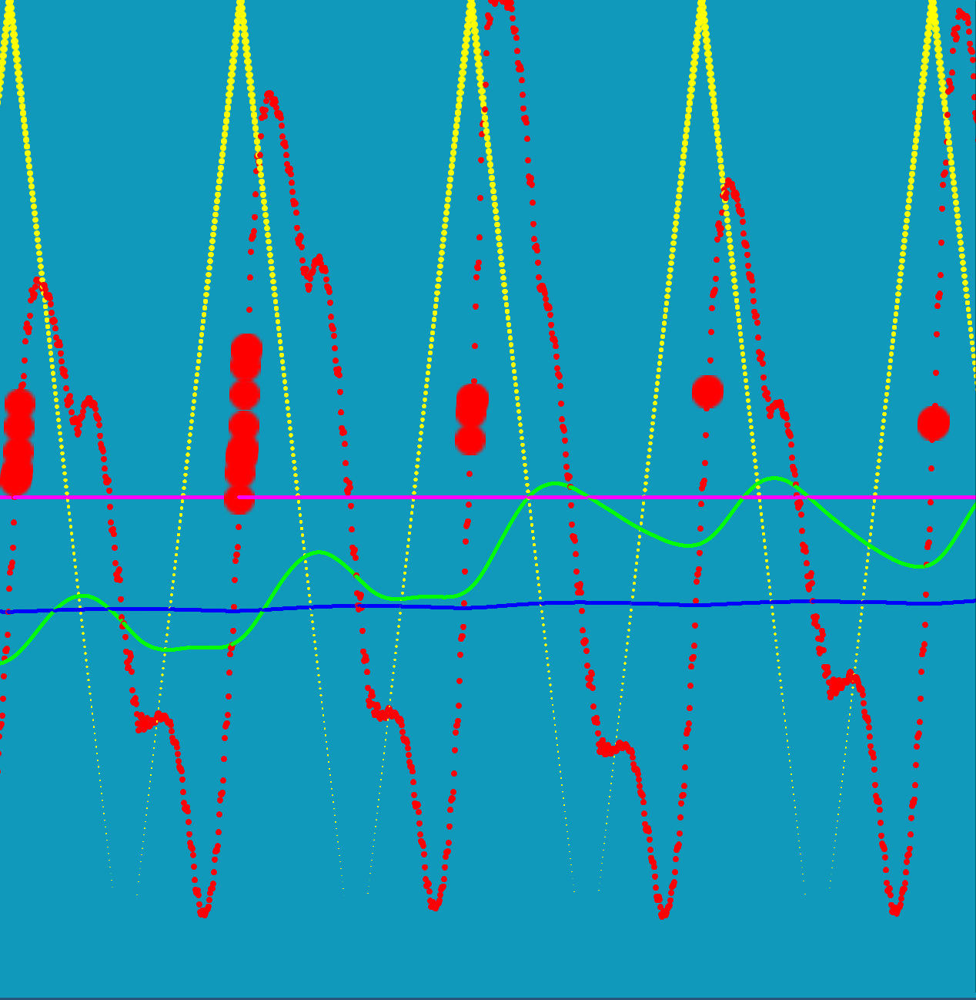

# About

Rewrite of [oscilloscope-visualizer](https://github.com/alexd2580/oscilloscope-visualizer) (C/OpenGL) in Rust/Vulkan.


### Beat/BPM Tracking

Huge focus on BPM tracking for reliable and rhytmical effects.
Beat detection alone is not sufficient for good effects that can bridge gaps in the beat. The whole pipeline looks roughly like this:

1. Tap audio data (mono)
1. Normalize with decay normalizer (dynamic/manual changes in volume shouldn't affect the visualizer)
1. Use a biquad band pass to filter low frequencies
1. Use another decay normalizer on the bass signal
1. Compute the short-term energy of the signal using a window
1. Every n-th (64) sample, evaluate whether the current sample is a beat
1. Record the timestamps of beat samples and the deltas relative to the previous beat in a ringbuffer
1. Ignore deltas which lie clearly outside the desired BPM range (110-160)
1. Compute the mode over tha last N integer BPM values (60.0 / period) (from the ringbuffer)
1. Use the mode as a candidate for a BPM change
1. Every n-th (4) beat, check whether the BPM candidate has a phase with minimal error
1. Error is defined as the sum of squares of offsets from their expected positions
1. If the candidate matches the series better than the current phase/period, reset to the new candidate
1. Otherwise deny the BPM switch and use gradient descent to finetune the phase

The BPM tracker works OK, what definitely needs improvement is beat detection
across a wide variety of music styles/types. Even just electronic music has
many different styles of bass at different frequency bands.

### Debugging

For live-debugging I have build a websocket server that emits the current state
of the bass-energy-filter, beat detector and bpm confidence. It is consumed by
a µ PIXI.js app that displays it in a live graph.



# Running

```bash
# It's rust.... not the 'x', it's an alias.
# WARNING: This messes with your pulseaudio setup (`-p true`).
# If you don't want that then run the app manually.
# See `.cargo/config.toml` and `cargo run -- --help` for reference.
cargo runx
```

# Linting

```bash
# Is pedantic about stuff, but also disables some obnoxious lints.
cargo lint
```

# Pulseaudio setup

The app has two modes: "passthrough" (default) and "listen". In "listen" mode
you control the audio input yourself, e.g. In `pavucontrol` you have to set up
the app to record from the monitor of your audio device. The problem is that
the visualization is delayed oh so slightly. The delayed beat detection is
especially noticeable. To improve this you can go "passthrough" mode, which:

- Works only with pulseaudio (or pipewire), `pactl` is required
- Creates a virtual sink
- Sets the virtual sink as the default sink
- Sets the source of the visualizer to the monitor of the virtual sink
- Sets the sink of the visualizer to the previous default sink
- Resets the default sink to the previous default on app exit

# Future development

* Visualizations
* Mix and match of different visualizations
* Various "Improvements"
* Cleanup of codebase
* Web based stats page instead of logs

# Current TODOs:

- [x] Sequence of multiple shaders
- [x] Compute norm of DFT once instead of inside shader
- [x] Different push-constants per shader
- [x] ~Separate descriptor sets per shader~
- [x] VK_KHR_push_descriptor
- [ ] ~Fix descriptor set allocation and binding~
- [x] Repopulate descriptors cache on shader rebuild, separate it as from `Descriptors`?
- [x] Bind images in different binding modes, e.g. sampler vs storage_image
- [x] Resize client images on resize. Static ~vs dynamic? Vulkan managed?~
- [x] Improve sequence of vulkan high-level operations: swapchain reinit, image reinit, etc...
- [x] Smoothing of input data, less stutter
- [x] Beat detection
- [x] BPM analysis
- [x] Notice the importance of running a compositor when under X -_-
- [x] Audio passthrough with delay
- [x] Passthrough selector
- [x] Automatic pulse null-sink setup and audio routing and restore on exit
- [x] ~Check that glslc is present.... use native impl? does it exist?~ shaderc-rs! ~?~
- [ ] Check that pactl and pulsecmd are present before allowing "passthrough" mode
- [ ] Better delay control
- [ ] Revise BPM and beat detection.
- [ ] Better beat-effects. Check last_beat and next_beat
- [ ] Exponentialize dft index on CPU side once?
- [ ] use host_cached memory and flushes instead of _hoping_ that coherent writes work fine
- [ ] Run the app even without pipeline etc, when no shaders are working from the get-go.
- [ ] Better bloom? Using linear image samplers?
- [ ] mix and match
- [ ] Document the installation process and requirements
