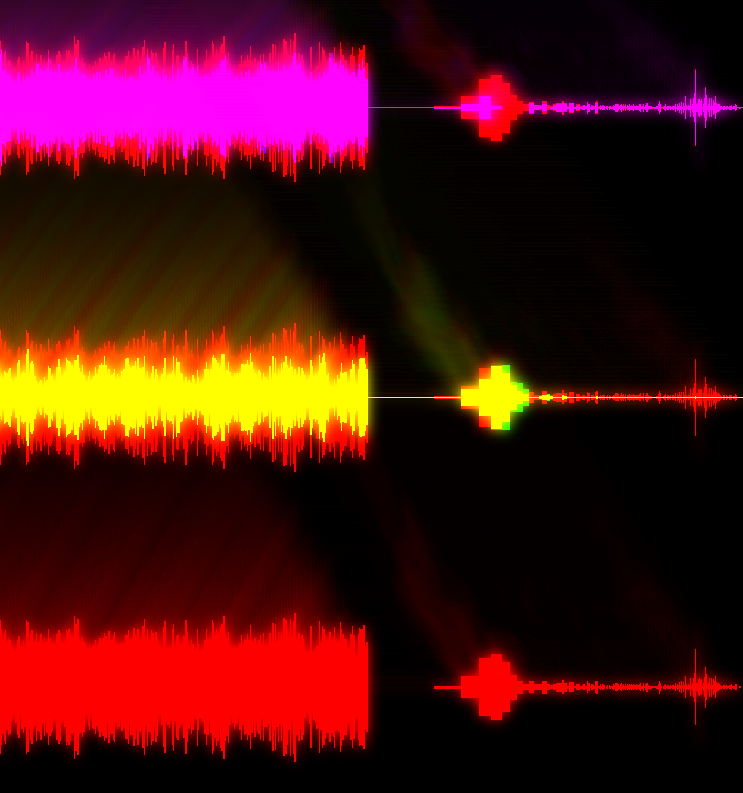

# About

Rewrite of [oscilloscope-visualizer](https://github.com/alexd2580/oscilloscope-visualizer) (C/OpenGL) in Rust/Vulkan.



# Running

```bash
# It's rust....
cargo run -- -s shaders/high_low_dft.comp shaders/bloom_h.comp shaders/bloom_v.comp shaders/bloom_combine.comp
```

# Future development

* Audio input and processing
* Fourier transforms
* Visualizations
* Beat/bpm detection
* Mix and mash of different visualizations

# Current TODOs:

- [x] Sequence of multiple shaders
- [x] Compute norm of DFT once instead of inside shader
- [ ] Exponentialize dft index on CPU side once?
- [ ] Resize client images on resize. Static vs dynamic? Vulkan managed?
- [ ] Fix descriptor set allocation and binding
- [ ] Separate descriptor sets per shader
- [ ] Bind images in different binding modes, e.g. sampler vs storage_image
- [ ] Improve sequence of vulkan high-level operations: swapchain reinit, image reinit, etc...
